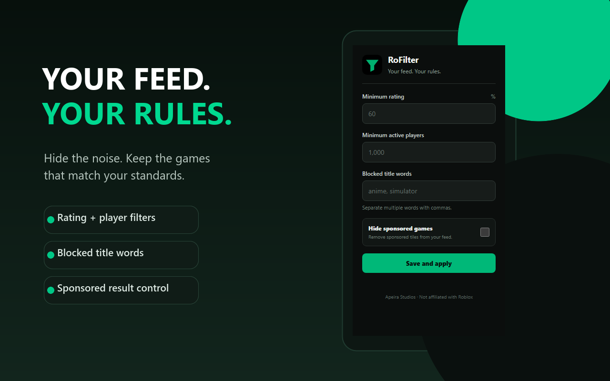

# RoFilter

**Your feed. Your rules.**

RoFilter is a lightweight Chrome extension by [Apeira Studios](https://apeirastudios.me/) that gives you control over the games shown on Roblox Home and Discover pages.

[Install from the Chrome Web Store](https://chromewebstore.google.com/detail/rofilter-game-quality-enh/mfbdhlnbimbigcfmmfonofkaccfpfion)

## What it does

- Hides games below your minimum rating percentage.
- Hides games below your minimum active-player count.
- Filters titles using your own comma-separated keywords.
- Removes sponsored game tiles when you choose.
- Applies changes to the active page without collecting browsing or usage data.

## Privacy and permissions

RoFilter requests only Chrome's `storage` permission. Your filter settings are stored with Chrome sync so they can follow your signed-in browser profile. Apeira Studios does not receive or sell your settings, browsing history, or usage data.

See [PRIVACY.md](PRIVACY.md) for the complete policy.

## Install from source

1. Clone or download this repository.
2. Open `chrome://extensions/` in Chrome or another Chromium-based browser.
3. Enable **Developer mode**.
4. Choose **Load unpacked** and select this directory.
5. Open a Roblox Home or Discover page, then configure RoFilter from the toolbar.

## Development

The extension uses Manifest V3 with plain HTML, CSS, and JavaScript. No build step or remote code is required.

## License

Released under the [MIT License](LICENSE).

RoFilter is an independent project and is not affiliated with, endorsed by, or sponsored by Roblox Corporation.
