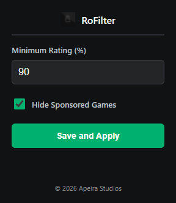

# RoFilter by Apeira Studios

## Overview
RoFilter is a Google Chrome and Chromium-based browser extension created by **Apeira Studios**. It enhances your Roblox browsing experience by allowing you to filter out games on the Discover and Home pages based on their like-to-dislike ratio. It also has a built-in feature to completely hide "Sponsored" games from your feed.

## Features
*   **Rating Filter:** Specify a minimum rating percentage (e.g., 60%). Any game with a rating below this threshold will be hidden from your view.
*   **Minimum Active Players:** Enter a minimum player count (e.g., 1000). Games with fewer current players will be removed from your feed.
*   **Banned Title Words:** Enter specific words (comma-separated, e.g., 'simulator, tycoon'). Any game containing these words in its title will be hidden.
*   **Remove Sponsored Games:** A simple toggle to hide all sponsored game tiles, keeping your feed organic.
*   **Infinite Scroll Support:** Automatically handles Roblox's infinite scroll, ensuring new games continue to load even when many are filtered out.

## Installation (Unpacked)
1. Download or clone this repository to your computer.
2. Open your Chromium-based browser (Chrome, Brave, Edge, etc.) and navigate to `chrome://extensions/`.
3. Enable **Developer mode** in the top right corner.
4. Click **Load unpacked** and select the directory containing the extension files.
5. The extension is now installed and ready to use!

## Usage
1. Go to any Roblox games page (e.g., `roblox.com/discover`).
2. Click the RoFilter extension icon in your toolbar.
3. Enter your desired minimum rating percentage.
4. Set a minimum active player count (optional).
5. Add any banned words to filter out specific game types (optional).
6. Toggle the "Hide Sponsored Games" option if desired.
7. Click **Save and Apply** and refresh the page to see your clean feed.

## License
This project is licensed under the MIT License - see the [LICENSE](LICENSE) file for details.

---
&copy; 2026 Apeira Studios
